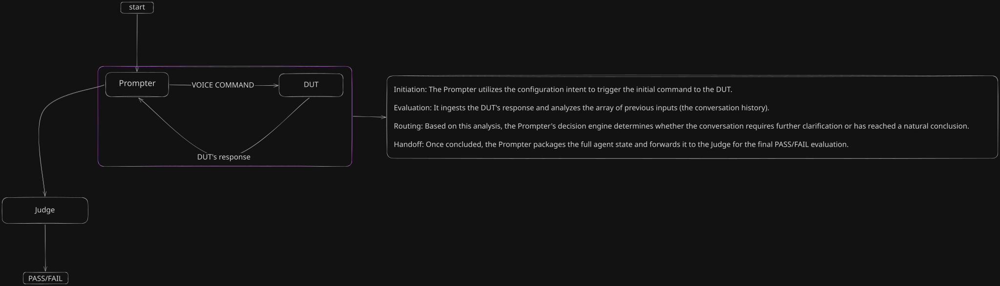

# Conversation Eval Pipeline

## Graph architecture
  

## how to use run.sh
```bash
Expected directory structure:
  MODEL_DIR/
  ├── reasoning/       
  │   ├── model1.gguf
  │   └── model2.gguf
  └── non_reasoning/   
      ├── model3.gguf
      └── model4.gguf
```
**running the script**
```bash 

chmod +x run.sh
./run.sh \
  --model-dir /path/to/your/MODEL_DIR \
  --port 8000 \
  --ctx-size 1024 \
  --ngl 99
```
